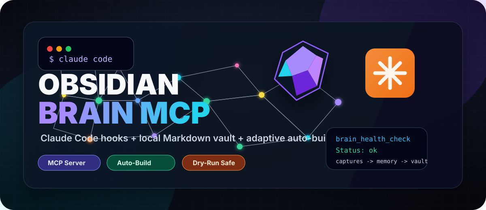
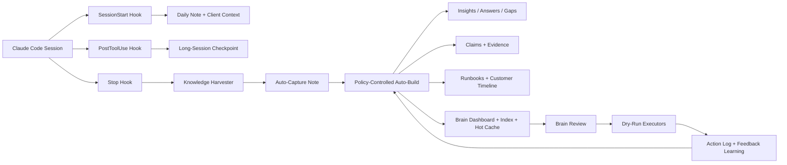

<div align="center">

# Obsidian Brain MCP

**A filesystem-native second brain for Claude Code and Obsidian.**

Build a living technical knowledge base while you work: capture sessions, promote durable knowledge, track evidence, generate runbooks, maintain customer memory, and keep risky refactors dry-run-first.

[](package.json)
[](tsconfig.json)
[](server.ts)
[](hooks/)
[](README.md)
[](LICENSE)

**[Quick Start](#quick-start)** · **[What It Does](#what-it-does)** · **[Brain Workflow](#brain-workflow)** · **[Tool Surface](#tool-surface)** · **[Safety Model](#safety-model)**



</div>

---

## What It Does

Obsidian Brain MCP turns Claude Code into a local-first knowledge worker for sysadmins, consultants, and technical operators. It indexes your Obsidian vault directly on disk, captures meaningful Claude Code sessions, and gradually turns operational work into reusable memory.

| Layer | What happens | Output |
|---|---|---|
| **Observe** | Claude Code hooks detect project context, commands, errors, and outcomes | Daily notes, session captures |
| **Promote** | Auto-build gates convert strong captures into durable knowledge | Insights, answers, gaps, claims, runbooks |
| **Verify** | Evidence metadata tracks confidence, sources, rechecks, and contradictions | Claims, evidence reports, schedules |
| **Maintain** | Review tools propose cleanup while executors stay dry-run-first | Dashboards, MOCs, link fixes, lifecycle updates |
| **Learn** | Archived auto-build artifacts become feedback for stricter future gates | Usefulness score, adaptive promotion behavior |

## Quick Start

```bash
git clone https://github.com/amolani/obsidian-brain-mcp-server.git
cd obsidian-brain-mcp-server
npm install
export VAULT_PATH=/path/to/your/obsidian/vault
```

Register the MCP server globally for Claude Code:

```bash
claude mcp add-json -s user obsidian-brain '{
  "command": "node",
  "args": ["/absolute/path/to/obsidian-brain-mcp-server/server.ts"],
  "env": {
    "VAULT_PATH": "/path/to/your/obsidian/vault"
  }
}'
```

Then open a fresh Claude Code session and run:

```text
brain_health_check
```

If the health check is clean, just work normally. Captures, dashboards, evidence, timelines, and maintenance views are built around your actual Obsidian files.

## Session Experience

```text
> brain_health_check
Status: ok
Checks: policy ok, hooks ok, auto-build manifest ok, action log ok

> Work normally in Claude Code
Stop hook -> Knowledge Harvester -> Auto-Capture -> Auto-Build Report

> brain_metrics
Auto-Captures: 18
Auto-promoted: 42
Auto-build usefulness score: 0.86
```

## Brain Workflow



## Why It Feels Different

Most note systems wait for you to organize after the work is done. This one watches the work itself.

- **Claude Code-native**: MCP tools plus SessionStart, PostToolUse, and Stop hooks.
- **Obsidian-native**: plain Markdown, local folders, backlinks, frontmatter, no database lock-in.
- **Sysadmin-friendly**: customer folders, runbooks, commands, incidents, TODOs, evidence, lifecycle state.
- **Safe automation**: auto-build can write derived knowledge; risky operations stay out of automatic apply.
- **Adaptive**: archiving noisy auto-build output teaches the next run to be stricter.

## Tool Surface

<details open>
<summary><strong>Read & Navigate</strong></summary>

| Tool | Purpose |
|---|---|
| `vault_search` | Structured search across title, tags, folders, status, and content |
| `semantic_search` | Local semantic-style search with weighted note vectors and snippets |
| `get_note_context` | Full note context with frontmatter, backlinks, outgoing links, TODOs, related notes |
| `build_context_pack` / `recall_context` | Explicit read-only recall; never auto-injected into working memory |
| `vault_overview`, `todo_list`, `weekly_review`, `daily_note` | Operating views for the vault and daily work |

</details>

<details open>
<summary><strong>Create, Capture & Promote</strong></summary>

| Tool | Purpose |
|---|---|
| `capture_v2` | Smart capture with client/Technik routing, normalized tags, and dry-run previews |
| `save_insight` / `save_decision` / `save_answer` | Durable manual memory under `Knowledge/` |
| `ingest_source` / `extract_claims` | Source ingestion and claim extraction with evidence fields |
| `generate_runbook` | Runbook generation from captured operational sessions |
| `extract_troubleshooting_pattern`, `promote_capture_to_runbook`, `generate_postmortem` | Incident and troubleshooting workflows |

</details>

<details open>
<summary><strong>Brain Layer</strong></summary>

| Tool | Purpose |
|---|---|
| `brain_health_check` | Readiness check for policy, hooks, generated surfaces, manifest, and action log |
| `brain_review` / `brain_apply_review_item` | Central review queue plus one-action dry-run-first executor |
| `brain_auto_build` | Policy-controlled promotion of captures into durable memory and generated surfaces |
| `archive_auto_build_run` | Archive one auto-build run's artifacts and record negative learning feedback |
| `brain_checkpoint` | Long-session checkpoint note with optional incremental auto-build |
| `brain_metrics` / `brain_schedule` | Health metrics and propose-only upkeep schedule |
| `build_brain_dashboard`, `build_knowledge_index`, `update_hot_cache` | Obsidian-visible operating surfaces |
| `build_memory_timeline`, `build_customer_snapshot` | Customer/project memory surfaces |

</details>

<details>
<summary><strong>Maintenance</strong></summary>

| Tool | Purpose |
|---|---|
| `find_duplicates` / `merge_duplicates` | Duplicate analysis and dry-run-first merge workflow |
| `rename_note` | Rename/move refactor with wikilink and frontmatter updates |
| `triage_note` / `triage_inbox` | Inbox classification, target folders, duplicate checks, link suggestions |
| `score_note_quality` / `list_low_quality_notes` | Quality scoring for title, metadata, tags, links, TODOs, structure, and freshness |
| `find_broken_links` / `fix_broken_links` | Broken link detection and repair |
| `lint_frontmatter` / `fix_frontmatter` | Profile-aware frontmatter schemas |
| `generate_mocs`, `run_safe_maintenance`, `run_vault_maintenance` | Generated structure and safe batch maintenance |

</details>

## Safety Model

`brain-policy.json` is the local safety contract.

| Rule | Behavior |
|---|---|
| Working memory is manual | `recall_context` only runs when you ask for it |
| Safe auto-build is allowed | Captures can become derived knowledge, reports, dashboards, timelines |
| Risky refactors are blocked from auto-apply | Duplicate merges, renames, folder organization, broken-link rewrites, link application |
| Every write is observable | Mutating tools append to `.action-log.jsonl` |
| Dry-run-first remains the default for risky operations | Apply modes are explicit and policy guarded |
| Feedback changes future behavior | Archived auto-build artifacts make noisy categories stricter |

## How It Works

The server indexes your vault on start and keeps an in-memory index of notes, tags, backlinks, TODOs, frontmatter, and links. It watches the vault directory and updates incrementally as Markdown files change.

Classification is local and rule-based:

- `clients.json` — known clients and keyword aliases
- `technik-categories.json` — technical categories and subcategories
- `tag-aliases.json` — tag normalization map
- `tech-terms.json` — auto-tag vocabulary for captures

All files are editable JSON and live in the repo by default.

## Requirements

- Node.js ≥ 22 (native TypeScript support) or Node ≥ 18 with `tsx`
- An Obsidian vault (structure doesn't matter — the server adapts)

## Full Installation

### 1. Clone and install

```bash
git clone https://github.com/amolani/obsidian-brain-mcp-server.git
cd obsidian-brain-mcp-server
npm install
```

### 2. Configure your vault path

Set via environment variable:

```bash
export VAULT_PATH=/path/to/your/obsidian/vault
```

### 3. Register the MCP server with Claude Code

Globally (available in every session):

```bash
claude mcp add-json -s user obsidian-brain '{
  "command": "node",
  "args": ["/absolute/path/to/obsidian-brain-mcp-server/server.ts"],
  "env": {
    "VAULT_PATH": "/path/to/your/obsidian/vault"
  }
}'
```

For Node < 22, use `tsx` instead:

```bash
npm install -g tsx
claude mcp add-json -s user obsidian-brain '{
  "command": "tsx",
  "args": ["/absolute/path/to/obsidian-brain-mcp-server/server.ts"],
  "env": {
    "VAULT_PATH": "/path/to/your/obsidian/vault"
  }
}'
```

Verify: `claude mcp list` should show `obsidian-brain: ✓ Connected`.

### 4. (Optional) Register hooks for automation

Add to `~/.claude/settings.json`:

```json
{
  "hooks": {
    "SessionStart": [
      {
        "hooks": [
          {
            "type": "command",
            "command": "node /absolute/path/to/obsidian-brain-mcp-server/hooks/session-context.ts",
            "timeout": 8
          }
        ]
      }
    ],
    "PostToolUse": [
      {
        "hooks": [
          {
            "type": "command",
            "command": "node /absolute/path/to/obsidian-brain-mcp-server/hooks/session-checkpoint.ts",
            "timeout": 12
          }
        ]
      }
    ],
    "Stop": [
      {
        "hooks": [
          {
            "type": "command",
            "command": "node /absolute/path/to/obsidian-brain-mcp-server/hooks/knowledge-harvester.ts",
            "timeout": 15,
            "async": true
          }
        ]
      }
    ]
  }
}
```

Hook environment requires `VAULT_PATH` to be set (inherited from your shell or set via Claude Code env config).

### 5. (Optional) Add client instructions

Create `CLAUDE.md` in your vault or globally at `~/.claude/CLAUDE.md`:

```markdown
The obsidian-brain MCP server is available. Use it as the primary source of knowledge.
- Search knowledge → vault_search
- Get note context → get_note_context
- Capture new knowledge → capture
```

## Configuration files

### `clients.json`

```json
{
  "AKBD": ["AKBD", "albert-kleiner"],
  "Neckartenzlingen": ["naik"],
  "Merian": ["niarian"]
}
```

Keys = canonical client names. Values = keyword aliases matched against CWD and content.

### `technik-categories.json`

```json
{
  "Linuxmuster": {
    "keywords": ["linuxmuster", "sophomorix", "lmn"],
    "filenameHints": ["lmn", "linuxmuster"],
    "priority": 10,
    "subcategories": {
      "Linbo": {
        "keywords": ["linbo", "linbofs", "patchclass"],
        "filenameHints": ["linbo"]
      }
    }
  }
}
```

### `tag-aliases.json`

```json
{
  "lmn": "linuxmuster",
  "pve": "proxmox",
  "ad": "active-directory"
}
```

Left side = alternate spelling. Right side = canonical form.

## Environment variables

| Variable | Purpose | Default |
|----------|---------|---------|
| `VAULT_PATH` | **Required.** Path to your Obsidian vault root. | — |
| `CLIENTS_PATH` | Override path to `clients.json`. | `{project}/clients.json` |
| `TECHNIK_CATEGORIES_PATH` | Override path to `technik-categories.json`. | `{project}/technik-categories.json` |
| `TAG_ALIASES_PATH` | Override path to `tag-aliases.json`. | `{project}/tag-aliases.json` |
| `HARVESTER_LOG` | Knowledge Harvester log file. | `/tmp/knowledge-harvester.log` |
| `HARVESTER_STATE_DIR` | Per-session state dir (prevents re-processing). | `/tmp/knowledge-harvester-state` |
| `HARVESTER_SUGGESTIONS_LOG` | Log for client/subcategory suggestions. | `/tmp/knowledge-harvester-suggestions.log` |
| `SESSION_CHECKPOINT_LOG` | Long-session checkpoint hook log file. | `/tmp/obsidian-brain-session-checkpoint.log` |
| `SESSION_CHECKPOINT_STATE_DIR` | Long-session state dir for debounce/command counts. | `/tmp/obsidian-brain-session-state` |
| `TECHNIK_SUGGESTIONS_LOG` | Log for category suggestions. | `/tmp/technik-suggestions.log` |

## Usage

Once registered, just work normally in Claude Code. Ask things like:

- "What do we know about Neckartenzlingen?"
- "Show me all open TODOs."
- "Save this: The DHCP server needs to run on the firewall, not the LMN."
- "Generate a runbook for the linuxmuster installation."
- "Run vault maintenance."

The Knowledge Harvester runs automatically after each Claude response only when `brain-policy.json` allows `hooks.autoCapture`. If the session had substantial work (>= 3 bash commands, >= 2 procedures with outcomes), it writes a capture note to the appropriate folder.

When `automation.mode` is `auto_build`, a safe auto-build pass runs immediately after a successful session capture:

- promotes the capture into durable `save_insight` / `save_answer` / gap notes when clear signals exist
- runs a quality gate before promotion: skips banal/short items and similar existing knowledge
- records processed source hashes in `.brain-auto-build-manifest.json` to prevent repeated promotion of the same capture
- enforces policy limits for maximum new notes, claim count, and runtime
- creates an Auto-Build report under `Maintenance/Auto-Build/`
- promotes runbook candidates only when enough procedural signals exist
- learns from archived auto-build artifacts and repeated rejected feedback, making noisy promotion categories stricter over time
- extracts claims into `Knowledge/Claims/`
- updates evidence metadata on the capture
- refreshes `Knowledge/_brain.md`, `Knowledge/index.md`, `Knowledge/hot.md`
- refreshes `Kunden/{Client}/_timeline.md` and `Kunden/{Client}/_snapshot.md` when a client was detected

Risky operations such as duplicate merges, note renames, folder reorganization, broken-link rewrites, and link suggestion application stay out of automatic apply.

## Brain Policy

`brain-policy.json` is the local safety contract for hooks, protected paths, and manual memory behavior.

- Working memory is `manual_only`: `recall_context` runs only when explicitly called, and no context is injected automatically.
- `update_hot_cache` is also manual-only; it writes `Knowledge/hot.md` only when explicitly applied.
- Evidence, dashboard, timeline, feedback, and claim extraction tools are explicit/dry-run-first; `brain_schedule` only proposes work.
- `automation.mode=auto_build` allows safe after-session writes that create derived knowledge and refresh generated surfaces.
- `automation.duringSession.autoCheckpoint=true` enables debounced long-session checkpoints; `minMinutesBetweenCheckpoints`, `minCommandsBetweenCheckpoints`, and `maxCheckpointsPerSession` limit write frequency.
- `automation.neverAutoApply` blocks risky refactors from automatic execution.
- Hook auto-organization is disabled by default: `hooks.autoOrganize=false`.
- Auto-capture and daily-note creation are policy-controlled.
- Protected folders such as `.obsidian/`, `.trash/`, `System/`, and `Templates/` are blocked for guarded writers.
- Tool policies declare write capability, risk level, and whether dry-run-first behavior is expected.
- Source ingest uses `.raw/.manifest.json` to skip unchanged sources unless `force=true`.

## Recommended Workflow

Use the vault as a dry-run-first operating loop:

1. Start work normally in Claude Code. The SessionStart hook creates today's Daily note when policy allows it and detects the client from your current folder when possible. Automatic Referenz→Technik organization is disabled unless `brain-policy.json` explicitly enables it.
2. Before creating new knowledge, search first with `vault_search` or `semantic_search`. Use `recall_context` when you explicitly want manual working-memory recall for a topic.
3. Capture rough knowledge with `capture_v2` in `review` or `dry_run` mode for important notes, then apply once the suggested folder/title/tags look right. Use `save_insight`, `save_decision`, or `save_answer` when you want an explicit durable memory instead of an auto-classified capture.
4. During work, use `daily_note` for lightweight chronological notes and TODOs. Use `todo_list` or `weekly_review` to pull open work back into focus.
5. When a question remains open or two notes disagree, use `flag_knowledge_gap` or `flag_contradiction`. Resolve it later with `resolve_gap`, so the vault keeps uncertainty visible instead of silently mixing weak facts with confirmed knowledge.
6. After substantial terminal work, let the Stop hook harvest procedures automatically when policy allows it. For reusable operational docs, run `generate_runbook` against the topic/client after captures exist.
7. For bigger investigations, create a `create_research_plan` first. It pulls local context and gives you a checklist for source ingest, final answer/decision capture, and contradiction handling.
8. Ingest durable sources with `ingest_source`, then use `extract_claims` to turn source text into explicit claims. Use `update_evidence` to set confidence, sources, recheck dates, and contradiction references.
9. Run `brain_review` as the central operating view. It proposes items across maintenance, evidence, open questions, contradictions, quality, links, lifecycle, and index/cache drift. Apply one item at a time with `brain_apply_review_item`, first as dry-run. Record preference signals with `record_brain_feedback`.
10. Periodically refresh `Knowledge/_brain.md`, `Knowledge/hot.md`, `Knowledge/index.md`, and customer timelines with `build_brain_dashboard`, `update_hot_cache`, `build_knowledge_index`, and `build_memory_timeline`.
11. Let `brain_auto_build` run automatically after captures through the Stop hook. During long sessions the checkpoint hook can write `Knowledge/Checkpoints/` and run an incremental auto-build when command/time thresholds are reached; you can still call `brain_checkpoint` or `brain_auto_build` explicitly.
12. If an auto-build run produced noisy derived notes, run `archive_auto_build_run` with the original `source_path`; preview first, then archive only that run's generated artifacts without touching the capture. The archive action records negative feedback for the affected auto-build categories.
13. Use `brain_metrics` to watch whether auto-build is producing useful knowledge, whether archived/rejected categories are accumulating, and whether evidence issues grow.
14. In a fresh Claude session, run `brain_health_check` first. It reports whether policy, hooks, generated surfaces, manifest, and action log are ready.
15. Use `brain_schedule` for propose-only upkeep: due evidence rechecks, open contradictions, missing dashboards, and explicit next tools.
16. For maintenance, run `run_safe_maintenance` first as dry-run. Apply individual executors only after reviewing changes: lifecycle updates, link suggestions, frontmatter fixes, broken-link fixes, MOCs, and semantic-index rebuild.
17. Periodically run `organize_referenz` dry-run, then apply manually. Flat `Referenz/` is treated as staging; durable technical knowledge should end up in `Technik/{category}/{sub}/`.

## Folder conventions

The server assumes (but doesn't require) this structure:

```
YourVault/
├── Kunden/                # Client projects
│   └── {ClientName}/
├── Technik/               # Technical reference
│   ├── Linuxmuster/
│   │   ├── Linbo/
│   │   └── Sophomorix/
│   ├── Docker/
│   └── Proxmox/
├── Daily/                 # Daily notes (auto-created)
├── Knowledge/             # Manual memory, claims, evidence, dashboard, hot cache, index, gaps, contradictions
├── Maintenance/           # Review queues (auto-generated)
├── .raw/                  # Immutable source documents and ingest manifest
├── Inbox/                 # Unsorted captures
├── Referenz/              # Misc reference (organized into Technik/ automatically)
└── Persönlich/            # Private
```

## Development

### Run tests

```bash
npm test
```

The test suite covers vault indexing, link resolution, search, templates, capture categorization, duplicate detection, broken links, frontmatter linting, MOC generation, brain auto-build, health checks, and the Knowledge Harvester end-to-end.

### Project structure

```
obsidian-brain-mcp-server/
├── server.ts                      # MCP server entry point, tool registration
├── vault.ts                       # Core Vault class (indexing, search, maintenance)
├── technik-categories.ts          # Category classifier
├── brain-policy.json              # Local safety policy for hooks, tools, protected paths, and manual recall
├── clients.json                   # Client definitions (editable)
├── technik-categories.json        # Category rules (editable)
├── tag-aliases.json               # Tag normalization (editable)
├── hooks/
│   ├── session-context.ts         # SessionStart hook
│   ├── session-checkpoint.ts      # Long-session checkpoint hook
│   ├── knowledge-harvester.ts     # Stop hook (captures knowledge)
│   └── daily-note-hook.ts         # Simple daily note creator
└── tests/
    ├── vault.test.ts
    ├── categories.test.ts
    ├── harvester.test.ts
    └── fixtures/
```

### Architecture

- **Analyzer layer**: `find_duplicates`, `find_broken_links`, `lint_frontmatter`, `generate_mocs` (dry-run), `getOverview` — pure read, no side effects.
- **Recommender layer**: `run_vault_maintenance` orchestrates analyzers and writes a review queue to `Maintenance/{date}-review.md`.
- **Executor layer**: `fix_broken_links`, `fix_frontmatter`, `organize_referenz`, `generate_mocs`, `apply_lifecycle_updates`, `apply_link_suggestions`, `run_safe_maintenance` — default to `dry_run=true` for safety.

All mutations respect the `quelle: moc-generator` / `quelle: knowledge-harvester` frontmatter marker so user-authored notes are never overwritten.

## License

MIT
