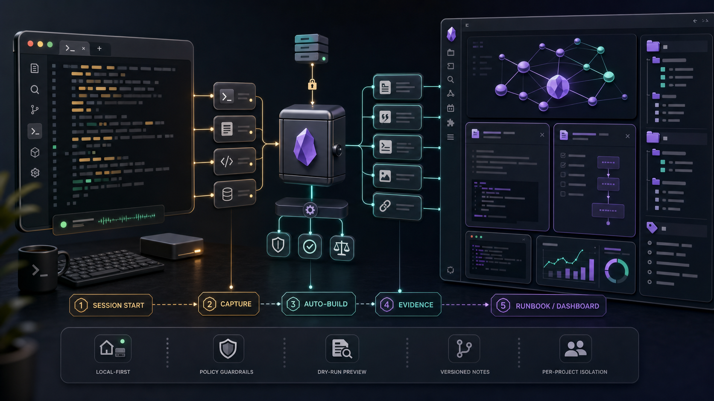
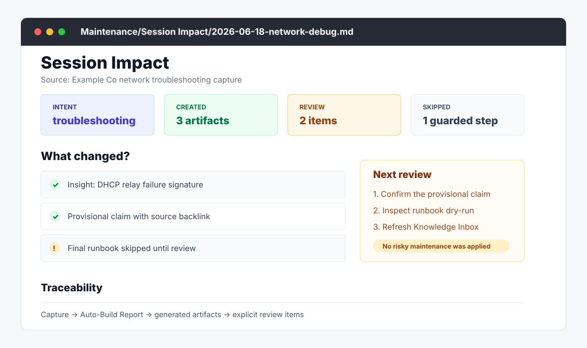
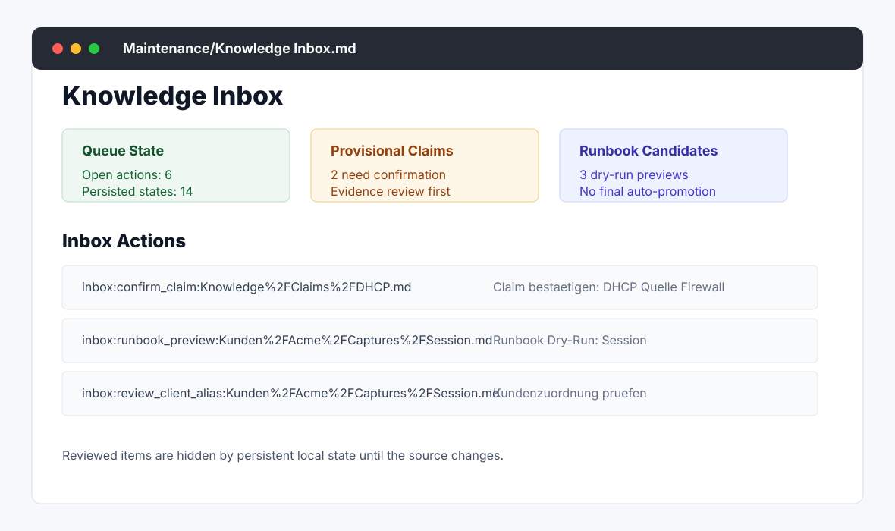
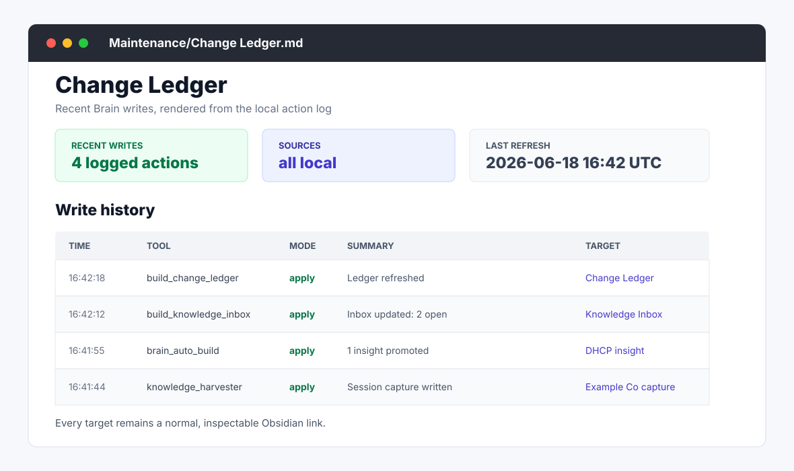
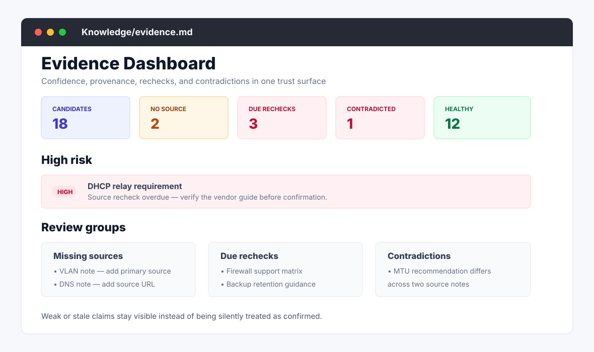
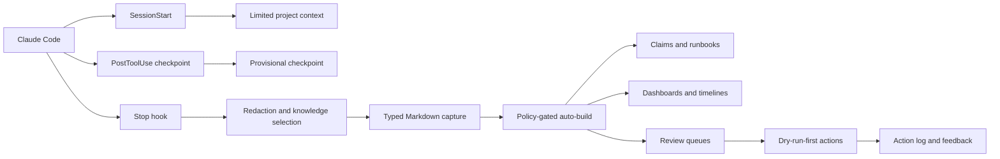

<div align="center">

# Obsidian Brain MCP

**Turn useful Claude Code work into searchable, evidence-aware Obsidian notes.**

Local-first knowledge capture for consultants, sysadmins, and technical teams. Your vault stays normal Markdown; automatic writes are bounded, inspectable, and separated from risky maintenance.

[](https://github.com/amolani/obsidian-brain-mcp-server/actions/workflows/ci.yml)
[](package.json)
[](https://code.claude.com/docs/en/mcp)
[](https://obsidian.md/)
[](docs/public-beta.md)
[](LICENSE)

**[Try the demo](#try-it-without-touching-your-vault)** · **Install: [Manjaro](#beginner-installation-on-manjaro) / [macOS](docs/install-macos.md)** · **[First session](#your-first-real-session)** · **[What gets written](#what-gets-written)** · **[Safety](#safety-and-privacy)** · **[Advanced guides](#advanced-guides)**



</div>

> [!IMPORTANT]
> This is a public beta that writes Markdown into the vault you configure. Start with the demo or a test vault, and keep a backup of an important vault.

## What this project does

Obsidian Brain MCP connects Claude Code to an Obsidian vault in two ways:

1. **MCP tools** let Claude search, read, capture, review, and maintain knowledge when you ask.
2. **Claude Code hooks** add limited project context, checkpoint long terminal sessions, and capture durable results automatically.
3. **Auto-build** turns sufficiently strong captures into reviewable claims, runbooks, dashboards, customer timelines, and maintenance views.

```text
Claude works  ->  local hook extracts useful evidence  ->  Markdown capture
      |                                                   |
      +---- MCP search and explicit tools <---------------+
                                                          |
                                      policy-gated auto-build and review
```

This is **not** an Obsidian Community Plugin. Obsidian does not need to be open. The server reads and writes the vault directly on disk.

### What happens automatically?

| Event | Automatic behavior | Typical result |
|---|---|---|
| A new Claude session starts | Detect the current client/project and provide limited metadata | Daily note and project context |
| A long command-heavy session continues | Save a rate-limited checkpoint | Provisional checkpoint note |
| Claude finishes a normal response | Start the asynchronous Knowledge Harvester | One capture is created or updated for that transcript |
| A capture passes policy gates | Run safe auto-build steps | Review items, claims, runbook candidates, dashboards |

`Stop` means “Claude finished a response”; it does not mean “the terminal session was closed.” An interrupted response does not produce the same event. The first-session section below shows how to close a session safely.

## Try it without touching your vault

After cloning the repository and installing its dependencies, create a disposable demo:

```bash
cd "$HOME/.local/share/obsidian-brain-mcp-server"
node cli.ts demo --out /tmp/obsidian-brain-demo --force
node cli.ts doctor --vault /tmp/obsidian-brain-demo --skip-hooks
```

Expected result:

```text
Health: ok
Checks: ... fail 0
```

Open `/tmp/obsidian-brain-demo` as a vault in Obsidian if you want to inspect the generated dashboard, capture review, evidence view, inbox, customer timeline, and change ledger.

Using a Mac? Follow the standalone **[beginner installation for macOS](docs/install-macos.md)**. Its repeatable Homebrew path covers macOS 14 or newer on both Apple silicon and Intel Macs.

## Beginner installation on Manjaro

This path assumes you are comfortable copying commands into a terminal, but does not assume Node.js, MCP, or Git knowledge.

### Before you start

You need:

- a Manjaro user account with `sudo` access;
- an Obsidian vault, or a folder you will open as a vault;
- a Claude Code-compatible Anthropic plan or API/Console access;
- an internet connection for installation and Claude Code.

The example uses these permanent locations:

```text
Program: ~/.local/share/obsidian-brain-mcp-server
Vault:   ~/Documents/Obsidian/MyBrain
```

You may use different paths. Always put paths containing spaces inside quotes.

### 1. Install the system packages

Update Manjaro and install Git, curl, the Node.js 22 LTS line, npm, and Obsidian:

```bash
sudo pacman -Syu --needed git curl nano nodejs-lts-jod npm obsidian
```

Verify the command-line tools:

```bash
git --version
node --version
npm --version
```

Node must report `v22.18.0` or newer. Newer supported Node releases are also accepted.

### 2. Install and sign in to Claude Code

Use Anthropic's native Linux installer:

```bash
curl -fsSL https://claude.ai/install.sh | bash
```

Open a new terminal, then run:

```bash
claude --version
claude doctor
claude auth login
claude auth status
```

The login command opens the browser flow. See the official [Claude Code installation guide](https://code.claude.com/docs/en/installation) if `claude` is not found after reopening the terminal.

### 3. Create or choose your Obsidian vault

Open Obsidian and choose **Create new vault**, or use an existing vault. For this example, create:

```text
/home/YOUR-NAME/Documents/Obsidian/MyBrain
```

Replace `YOUR-NAME` with your Linux username. You can also create the folder first:

```bash
mkdir -p "$HOME/Documents/Obsidian/MyBrain"
```

Obsidian can then open that folder as a vault. Existing notes may use any structure, but generated Brain artifacts use folders such as `Daily/`, `Knowledge/`, and `Maintenance/`.

### 4. Download and install Obsidian Brain MCP

Clone the repository into a location you will not move later:

```bash
mkdir -p "$HOME/.local/share"
export BRAIN_DIR="$HOME/.local/share/obsidian-brain-mcp-server"

git clone https://github.com/amolani/obsidian-brain-mcp-server.git "$BRAIN_DIR"
cd "$BRAIN_DIR"
npm ci
```

The MCP registration and hooks store absolute paths. If you move the repository later, repair the hooks and re-register the MCP server.

### 5. Set the two paths for this setup terminal

```bash
export BRAIN_DIR="$HOME/.local/share/obsidian-brain-mcp-server"
export VAULT_PATH="$HOME/Documents/Obsidian/MyBrain"

test -f "$BRAIN_DIR/server.ts" && echo "Brain server found"
test -d "$VAULT_PATH" && echo "Vault found"
```

Both confirmation lines should appear. Change the second path if your vault lives elsewhere.

These exports only prepare the current terminal. The next steps save the absolute paths into Claude's configuration. Copying `.env.example` to `.env` is **not** sufficient; this project does not automatically load `.env` files.

### 6. Check customer routing before the first real capture

`clients.json` maps exact folder-name aliases to customer names. Review it before using a cloned public configuration:

```bash
cd "$BRAIN_DIR"
nano clients.json
```

A minimal fictional example looks like this:

```json
{
  "_comment": "Canonical customer name -> exact folder aliases",
  "Example Co": ["example-co", "example"]
}
```

If Claude runs inside `/work/example-co/firewall`, the capture can be routed to `Kunden/Example Co/`. Without a confident exact alias, the Harvester deliberately uses `Technik/...` or `Referenz/...` instead of guessing a customer.

`clients.json` is tracked by Git. Never commit or push confidential customer names to a public repository. Teams that need private aliases should keep a private configuration outside the clone via `CLIENTS_PATH` and set that variable consistently for both the MCP server and Claude hooks.

### 7. Install the automatic Claude Code hooks

First preview the change:

```bash
cd "$BRAIN_DIR"
node cli.ts install-hooks --vault "$VAULT_PATH"
```

The preview does not write anything. If the paths look correct, apply it:

```bash
node cli.ts install-hooks --vault "$VAULT_PATH" --apply
```

The installer preserves unrelated Claude settings and creates a timestamped backup when an existing `~/.claude/settings.json` is changed.

Hooks are optional only if you want manual MCP tools without automatic session context, checkpoints, or captures. They are required for the automatic workflow described in this README.

The installer writes user-level hooks to `~/.claude/settings.json`; they therefore apply to every Claude Code project for that user unless the policy excludes a working directory.

### 8. Register the MCP server for Claude Code

Register the local stdio server at user scope so it is available in all your projects:

```bash
claude mcp add \
  --transport stdio \
  --scope user \
  --env "VAULT_PATH=$VAULT_PATH" \
  obsidian-brain \
  -- node "$BRAIN_DIR/server.ts"
```

This is equivalent to an `add-json` configuration, but is easier to copy safely. The syntax follows the official [Claude Code MCP guide](https://code.claude.com/docs/en/mcp).

If Claude says that `obsidian-brain` already exists, remove only that registration and run the add command again:

```bash
claude mcp remove --scope user obsidian-brain
```

### 9. Run the setup checks

Check the vault and hook configuration:

```bash
cd "$BRAIN_DIR"
node cli.ts doctor --vault "$VAULT_PATH"
```

Interpret the result like this:

| Status | Meaning on first setup |
|---|---|
| `fail` | Fix this before using the vault |
| `warn` | Often normal for a fresh vault whose generated views do not exist yet |
| `ok` | The check is fully satisfied |

The important first milestone is **0 failed checks**.

Ask Claude Code to verify the actual MCP connection. Start a completely new Claude session after changing hooks or MCP configuration:

```bash
mkdir -p "$HOME/obsidian-brain-test"
cd "$HOME/obsidian-brain-test"
claude
```

Then type this as a Claude prompt, not as a shell command:

```text
Use the brain_health_check tool. Do not change anything yet.
Explain every warning in simple language.
```

You can also enter `/mcp` inside Claude and confirm that `obsidian-brain` is connected. If Claude can call `brain_health_check` and reports no failures, the essential installation works.

## Your first real session

Use a dedicated test directory for the first automatic capture. Keep Claude open and start a second terminal with:

```bash
tail -F /tmp/knowledge-harvester.log
```

In Claude, use this reproducible test prompt:

```text
Create brain-test.json in the current test directory with a valid JSON object.
Record this explicit test decision: the fictional service demo-api uses port 43123
because port 3000 is reserved. Read the file back, parse it, and verify the exact
service name, port, and reason. Then give a final factual summary with these
headings: Goal, Decision, Change, Verification, Result, Open Points.
Do not use more tools after that summary.
```

Let Claude finish the final response normally. The `Stop` hook starts the local Harvester in the background. In the second terminal, expect one of these sequences:

```text
Captured: ...
Auto-build: ...
```

or, when an existing session capture was updated:

```text
Updated capture: ...
Auto-build: ...
```

If the session is intentionally rejected by the quality gate, the log instead explains that no sufficiently salient knowledge was found. That is a healthy skip, not a broken hook. If none of these messages appears within 120 seconds, press `Ctrl+C` and use the troubleshooting section before closing Claude.

After a healthy skip, you can still verify an explicit write safely by asking Claude to run `capture_v2` for the fictional test decision as a dry run first, show the proposed path, and apply it only after you approve the preview.

After `Auto-build:`, a healthy skip, or the troubleshooting check, press `Ctrl+C` in the log terminal. Use `/exit` in Claude only after any started capture has finished.

Important behavior:

- Do not interrupt the final Claude response.
- Do not use `/exit` immediately after the final response; wait for `Auto-build:`. If auto-build is disabled, wait for `Captured:` or `Updated capture:`.
- Not every conversation creates a note. Sessions without durable information are intentionally skipped.
- The Harvester updates the same session capture when the transcript changes; it does not create a new note after every response.
- Non-interactive `claude -p` runs may end before asynchronous hooks finish. Use an interactive session for this first test.

After a successful run, inspect the vault. Depending on routing and evidence quality, you should see a capture under `Kunden/{Client}/`, `Technik/{Category}/`, or `Referenz/`, plus generated views under `Knowledge/` and `Maintenance/`.

## Everyday workflow

Once installed, the normal loop is short:

1. Open a terminal inside the customer or project directory and run `claude`.
2. Let Claude use `vault_search` before creating duplicate knowledge.
3. Work normally: investigate, edit, run commands, and verify results.
4. Ask for a factual closing summary when the session contains important work.
5. Wait for the Harvester log confirmation before the final `/exit`.
6. Review uncertain claims and risky proposals later; they are not silently treated as confirmed facts.

Useful example prompts:

```text
Search the vault for everything we know about Example Co's firewall.

Use get_note_context for the most relevant note and show unresolved TODOs.

Capture this decision with capture_v2 as a dry run first.

Run brain_review and explain which item has the highest review value.

Show brain_metrics and explain whether capture quality is improving.
```

## What gets written

The output is ordinary Markdown plus local JSON state and caches:

```text
YourVault/
├── Daily/2026-08-06.md                     # daily work and capture links
├── Kunden/Example Co/                      # exact customer routing
│   ├── Example Co — Firewall change.md     # session capture
│   ├── _timeline.md                        # generated customer history
│   └── _snapshot.md                        # generated current context
├── Technik/                                # categorized technical knowledge
├── Referenz/                               # neutral staging when routing abstains
├── Knowledge/
│   ├── Claims/                             # evidence-aware statements
│   ├── Runbooks/                           # verified reusable procedures
│   ├── _brain.md                           # operating dashboard
│   ├── index.md                            # knowledge map
│   └── evidence.md                         # evidence and recheck view
├── Maintenance/
│   ├── Auto-Build/                         # per-capture reports
│   ├── Session Impact/                     # what one session changed
│   ├── Knowledge Inbox.md                  # persistent review queue
│   ├── Capture Review.md                   # capture quality surface
│   └── Change Ledger.md                    # recent Brain writes
├── .action-log.jsonl                       # append-only local action history
└── .brain-*.json / .semantic-index.json    # manifests, state, and caches
```

For an exact producer-by-producer inventory, see [What Gets Written](docs/what-gets-written.md).

## Safety and privacy

`brain-policy.json` is the local automation contract.

| Rule | Behavior |
|---|---|
| Vault remains filesystem-native | Notes stay Markdown; there is no hosted Brain database |
| Full note recall is explicit | `recall_context` runs only when requested; SessionStart injects only limited project metadata such as detected client, note paths, and aggregate TODO counts |
| Secret-like text is filtered | Automatic captures audit and redact recognized credential patterns before writing |
| Evidence and importance are separate | A useful statement is not automatically treated as well supported |
| Risky refactors stay manual | Duplicate merges, renames, moves, broken-link rewrites, and link application are never auto-applied |
| Risky tools are dry-run-first | Preview changes before explicitly applying them |
| Writes are observable | Applied mutations are recorded in `.action-log.jsonl` or delegated to an operation that records them |
| Protected folders remain protected | Guarded writers reject `.obsidian/`, `.trash/`, `System/`, `Templates/`, traversal, and symlink escapes |

“Local-first” does not mean that Claude is offline. The index, generated notes, manifests, and hook processing stay on your machine. When an MCP tool returns note content to Claude, that returned content becomes part of the Claude interaction and is handled according to your Claude account and provider settings.

Recommended precautions:

- back up an important vault before enabling automatic writes;
- begin with the demo or a test vault;
- review `clients.json` before the first capture;
- never place API keys or passwords in prompts or notes merely because redaction exists;
- use dedicated reviewer profiles for blind calibration work.

## Configuration

The default configuration lives next to the source code:

| File | Purpose |
|---|---|
| `clients.json` | Exact customer names and path/content aliases |
| `technik-categories.json` | Technical categories, subcategories, and routing keywords |
| `tag-aliases.json` | Normalizes alternate tag spellings |
| `tech-terms.json` | Vocabulary for automatic technical tags |
| `brain-policy.json` | Automation limits, protected paths, write risks, and dry-run rules |

Configuration is loaded from JSON. Edit carefully, keep valid JSON, and restart Claude after changes that affect a running MCP process.

Common environment overrides:

| Variable | Purpose | Default |
|---|---|---|
| `VAULT_PATH` | Required vault root | none |
| `CLIENTS_PATH` | Alternative customer configuration | `{project}/clients.json` |
| `TECHNIK_CATEGORIES_PATH` | Alternative category configuration | `{project}/technik-categories.json` |
| `TAG_ALIASES_PATH` | Alternative tag normalization map | `{project}/tag-aliases.json` |
| `TECH_TERMS_PATH` | Alternative technical vocabulary | `{project}/tech-terms.json` |
| `HARVESTER_LOG` | Automatic capture log | `/tmp/knowledge-harvester.log` |
| `HARVESTER_STATE_DIR` | Per-session capture state | `/tmp/knowledge-harvester-state` |

The complete scientific/reviewer variables are documented in [Scientific Engineering Contract](docs/scientific-engineering-contract.md) and [What Gets Written](docs/what-gets-written.md).

## Troubleshooting

### `node --version` is too old

Install Manjaro's Node.js 22 LTS package:

```bash
sudo pacman -Syu --needed nodejs-lts-jod npm
```

Then reopen the terminal and verify that the version is at least `v22.18.0`.

### `claude: command not found`

Open a new terminal after the native installer. Then run:

```bash
claude --version
claude doctor
```

If it is still missing, follow the official [Claude Code installation troubleshooting](https://code.claude.com/docs/en/troubleshoot-install).

### Doctor shows warnings on an empty vault

Warnings for missing dashboards, manifests, action logs, or review views can be normal before the first build. Fix every `fail`; use the first real session to create the initial generated surfaces.

### Claude cannot see `brain_health_check`

Confirm the stored registration and then restart Claude completely:

```bash
claude mcp get obsidian-brain
claude mcp list
```

These commands perform a live connection check and can take up to 30 seconds. In heavily sandboxed terminals they may time out even when a direct MCP client works; the decisive user-level test is whether a fresh interactive Claude session can call `brain_health_check`.

If the saved path is wrong, re-register it with the commands from installation step 8. Also verify the vault and hook inputs independently:

```bash
export BRAIN_DIR="$HOME/.local/share/obsidian-brain-mcp-server"
export VAULT_PATH="$HOME/Documents/Obsidian/MyBrain"

cd "$BRAIN_DIR"
node cli.ts doctor --vault "$VAULT_PATH"
```

### No capture appears

Check the Harvester log:

```bash
tail -n 50 /tmp/knowledge-harvester.log
```

Typical reasons are an interrupted final response, no durable information, a protected/excluded path, a detected secret with blocking enabled, or a lock held by an active calibration campaign.

### The repository was moved

Repair hooks at the new location, then remove and re-add the MCP registration:

```bash
export VAULT_PATH="$HOME/Documents/Obsidian/MyBrain"

cd "/new/absolute/path/obsidian-brain-mcp-server"
node cli.ts repair-hooks --vault "$VAULT_PATH"
node cli.ts repair-hooks --vault "$VAULT_PATH" --apply

claude mcp remove --scope user obsidian-brain
```

Run the registration command again with the new absolute server path. Inspect `~/.claude/settings.json` for obsolete hook entries from the old repository path; `repair-hooks` does not delete unrelated or unknown handlers.

### Paths contain spaces

Quote every variable expansion and path:

```bash
node cli.ts doctor --vault "$VAULT_PATH"
```

Do not write `--vault $VAULT_PATH` without quotes.

## Update or remove the installation

### Update

```bash
export BRAIN_DIR="$HOME/.local/share/obsidian-brain-mcp-server"
export VAULT_PATH="$HOME/Documents/Obsidian/MyBrain"

cd "$BRAIN_DIR"
git pull --ff-only
npm ci
node cli.ts repair-hooks --vault "$VAULT_PATH"
node cli.ts repair-hooks --vault "$VAULT_PATH" --apply
npm run release-check
```

Restart Claude after the update. If you edited tracked JSON configuration locally, save those changes before `git pull` and resolve any reported conflict deliberately.

### Remove

Remove the MCP registration first:

```bash
claude mcp remove --scope user obsidian-brain
```

There is not yet an `uninstall-hooks` command. Either:

- restore the timestamped `~/.claude/settings.json.bak-*` created during installation **only if you have made no later Claude settings changes**, or
- edit `~/.claude/settings.json` and remove only the three handlers pointing to this repository: `session-context.ts`, `session-checkpoint.ts`, and `knowledge-harvester.ts`.

After that, you may delete the cloned repository. Existing vault notes, generated Markdown, and Brain state remain in the vault until you review and remove them yourself.

## Selected MCP tools

The server exposes a large tool surface, but daily use usually needs only these:

| Tool | Use it for |
|---|---|
| `brain_health_check` | Verify policy, hooks, generated views, manifest, and action log |
| `vault_search` | Search titles, content, tags, folders, status, and projects |
| `get_note_context` | Read one note with links, backlinks, TODOs, and related notes |
| `capture_v2` | Preview and create a routed capture |
| `brain_review` | See the operational review queue |
| `brain_apply_inbox_item` | Preview or apply one explicit inbox action |
| `brain_metrics` | Inspect capture, promotion, evidence, and feedback health |
| `brain_run_background` | Refresh safe generated surfaces under a lock |

<details>
<summary><strong>More tool groups</strong></summary>

- **Read and recall:** `semantic_search`, `recall_context`, `build_context_pack`, `vault_overview`, `todo_list`, `weekly_review`
- **Durable memory:** `save_insight`, `save_decision`, `save_answer`, `ingest_source`, `extract_claims`, `generate_runbook`
- **Generated views:** `build_brain_dashboard`, `build_capture_review`, `build_evidence_dashboard`, `build_session_impact_report`, `build_change_ledger`
- **Dry-run maintenance:** `find_duplicates`, `rename_note`, `find_broken_links`, `lint_frontmatter`, `organize_referenz`, `run_safe_maintenance`
- **Scientific calibration:** `brain_calibration_review_batch`, `record_calibration_judgement`, `brain_calibration_evaluate`, campaign registration/closure, and sealed evaluation

Reviewer-only calibration tools are hidden from the default MCP mode and require a separate restricted server/profile.

</details>

## Background mode

The background runner refreshes safe generated surfaces, keeps risky maintenance in preview, prevents concurrent runs with a lock, and writes an inspectable report.

```bash
node cli.ts background --vault "$VAULT_PATH"          # preview
node cli.ts background --vault "$VAULT_PATH" --apply  # apply safe jobs
```

It writes `Maintenance/Background Run Report.md` and `.brain-background-last-run.json`. See [Production Setup](docs/production-setup.md) for unattended operation and runtime budgets.

## Product surfaces

These repository-native mockups use fictional data and mirror the generated Markdown views.

<p>
  
  
</p>

<p>
  
  
</p>

## Evidence and scientific calibration

The production model intentionally keeps **importance** and **support** separate:

- salience factors rank task relevance, decision/outcome utility, novelty, reusability, and specificity;
- evidence factors describe provenance quality, independent support, and conflicts;
- scores are ordinal engineering signals, not probabilities;
- weak or ambiguous knowledge goes to review rather than silent confirmation;
- seeded evaluation samples and blind reviewer tokens allow later calibration without exposing production rank during judgement;
- optional irreversible campaigns freeze the frame, reviewer roster, split plan, labels, runtime/source hashes, and externally anchored receipts before sealed evaluation.

The sealed evaluator never changes active weights and never grants a release decision automatically.

Start with ordinary capture and review. Calibration campaigns are an advanced, bounded workflow—not a task that must run after every Claude session.

Detailed contracts:

- [Scientific Engineering Contract](docs/scientific-engineering-contract.md)
- [Knowledge Distillation Contract](docs/knowledge-distillation-contract.md)
- [Session Digest Contract](docs/session-digest-contract.md)
- [Brain Quality Contract](docs/brain-quality-contract.md)
- [V1 Product Definition](docs/v1-product-definition.md)

<details>
<summary><strong>Dedicated blind-review MCP profile</strong></summary>

Use one isolated Claude profile/process per registered reviewer. Do not enable the normal production server in that reviewer session.

```bash
claude mcp add-json --scope user obsidian-brain-review '{
  "type": "stdio",
  "command": "node",
  "args": ["/absolute/path/to/obsidian-brain-mcp-server/server.ts"],
  "env": {
    "VAULT_PATH": "/absolute/path/to/your/vault",
    "OBSIDIAN_BRAIN_MCP_MODE": "calibration-review",
    "BRAIN_CALIBRATION_REVIEWER_ID": "reviewer-a",
    "BRAIN_CALIBRATION_VAULT_ID": "work-vault",
    "BRAIN_CALIBRATION_ANCHOR_DIR": "/absolute/path/to/external-anchors"
  }
}'
```

The reviewer ID is process-bound, not a digital signature. For regulated or externally published studies, combine isolated profiles with reviewer-specific credentials/signatures and independently operated timestamping or transparency infrastructure.

</details>

## Architecture



- **CLI path:** setup, doctor, demo, background, benchmark, quality, and release commands call focused services directly.
- **MCP path:** `server.ts` exposes schemas and dispatches tool requests through the `Vault` facade.
- **Hook path:** SessionStart adds bounded context, PostToolUse checkpoints long sessions, and Stop runs the asynchronous Harvester.
- **Service layer:** capture, retrieval, evidence, review, generated surfaces, maintenance, calibration, and safety remain separate modules.

## Development

```bash
npm ci
npm test
npm run typecheck
npm run brain-quality
npm run release-check
```

CI runs the release check on supported Node 22 and Node 24 lines. The quality harness replays anonymized fixtures in temporary vaults and checks capture recall, retrieval, promotion precision, faithfulness, evidence coverage, redaction, review stability, idempotency, and policy safety.

Project map:

```text
cli.ts                         setup and operational CLI
server.ts                      MCP stdio entry point
server-tools.ts                MCP schemas and modes
tool-handlers/                 domain request handlers
vault.ts                       live Markdown index and service facade
hooks/                         Claude Code automation hooks
services/                      capture, evidence, review, safety, calibration
brain-policy.json              automation and risk contract
clients.json                   customer aliases
technik-categories.json        technical routing
docs/                          product, operations, safety, and science contracts
tests/                         unit, integration, safety, and quality tests
```

## Advanced guides

| Guide | Read it when you need |
|---|---|
| [Public Beta](docs/public-beta.md) | current supported scope and limitations |
| [Production Setup](docs/production-setup.md) | unattended background runs and operating checks |
| [What Gets Written](docs/what-gets-written.md) | exact files, locks, manifests, and cleanup behavior |
| [Release Checklist](docs/release-checklist.md) | release and packaging verification |
| [Scientific Engineering](docs/scientific-engineering-contract.md) | scoring, blind review, evaluation, and sealed campaigns |
| [Brain Quality](docs/brain-quality-contract.md) | measurable quality and safety gates |

## License

MIT
