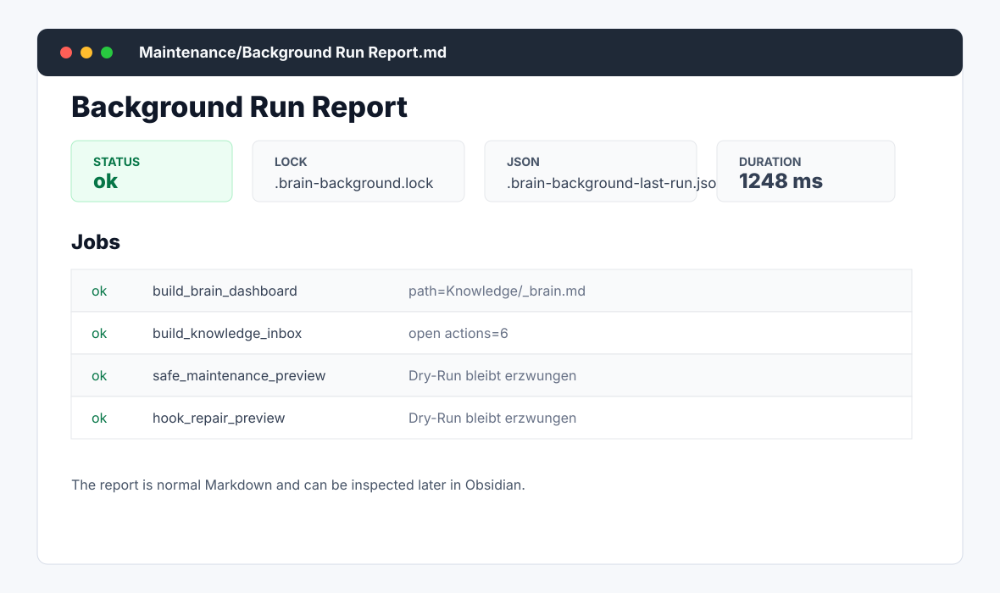
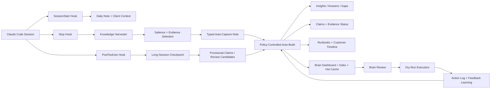

<div align="center">

# Obsidian Brain MCP

**Turn Claude Code sessions into a durable Obsidian knowledge system.**

Local-first MCP server for consultants, sysadmins, and technical operators who want their real work to become searchable memory: session captures, customer context, evidence-backed claims, runbooks, dashboards, and review queues.

[](package.json)
[](tsconfig.json)
[](server.ts)
[](hooks/)
[](README.md)
[](LICENSE)

**[Quick Start](#quick-start)** · **[Session Flow](#brain-workflow)** · **[What You Get](#what-lands-in-obsidian)** · **[Background Mode](#background-mode)** · **[Tools](#tool-surface)** · **[Safety](#safety-model)** · **[V1 Definition](docs/v1-product-definition.md)**


<sub>Product visual generated with OpenAI image generation; implementation is plain TypeScript, Markdown, and local files.</sub>

</div>

---

## The Short Version

Obsidian Brain MCP watches Claude Code work at the session boundary and turns useful traces into structured Obsidian knowledge. It is not a hosted notes app, not a vector database you have to trust blindly, and not an auto-refactor bot. Your vault stays Markdown-first and risky maintenance stays reviewable.

| You do the work | The MCP server extracts | Your vault gains |
|---|---|---|
| Debug systems, run commands, fix incidents | Commands, errors, outcomes, decisions | Session captures, TODOs, technical notes |
| Repeat operational procedures | Steps, prerequisites, validation signals | Runbooks and troubleshooting patterns |
| Research or compare facts | Claims, sources, confidence, contradictions | Evidence notes and recheck schedules |
| Work across customers or projects | Current folder, client aliases, related notes | Timelines, snapshots, project memory |
| Let the vault age | Quality gaps, missing links, stale evidence | Review queues and safe maintenance proposals |

## What It Does

Obsidian Brain MCP turns Claude Code into a local-first knowledge worker. It indexes your Obsidian vault directly on disk, captures meaningful Claude Code sessions, and gradually promotes operational work into reusable memory.

| Layer | What happens | Output |
|---|---|---|
| **Observe** | Claude Code hooks detect project context, commands, errors, and outcomes | Daily notes, session captures |
| **Promote** | Auto-build classifies captures by source and status, then promotes reviewable candidates | Insights, answers, gaps, provisional/confirmed claims, runbooks |
| **Verify** | Evidence metadata tracks confidence, sources, rechecks, and contradictions | Claims, evidence reports, schedules |
| **Maintain** | Review tools propose cleanup while executors stay dry-run-first | Dashboards, MOCs, link fixes, lifecycle updates |
| **Learn** | Archived auto-build artifacts become feedback for stricter future gates | Usefulness score, adaptive promotion behavior |

## What Lands In Obsidian

The output is deliberately boring in the best way: normal Markdown files in normal folders.

```text
YourVault/
├── Daily/2026-05-12.md                  # session notes and TODOs
├── Kunden/Client/_timeline.md           # project memory over time
├── Kunden/Client/_snapshot.md           # current client context
├── Knowledge/Claims/                    # evidence-backed statements
├── Knowledge/Runbooks/                  # reusable procedures
├── Knowledge/_brain.md                  # operating dashboard
├── Knowledge/index.md                   # knowledge map
├── Knowledge/hot.md                     # current high-value context
├── Maintenance/Auto-Build/              # reports, reviews, feedback
├── Maintenance/Knowledge Inbox.md       # review queue with persistent item state
├── Maintenance/Background Run Report.md # unattended run report
└── .brain-*.json / .semantic-index.json # local manifests, feedback, state, caches
```

## Quick Start

Node.js 22.18.0 or newer is required. The CLI, hooks, and MCP server run the TypeScript entrypoints directly with `node`.

```bash
git clone https://github.com/amolani/obsidian-brain-mcp-server.git
cd obsidian-brain-mcp-server
npm install
export VAULT_PATH=/path/to/your/obsidian/vault
```

Run the local setup doctor:

```bash
node cli.ts doctor --vault "$VAULT_PATH"
node cli.ts install-hooks --vault "$VAULT_PATH"
node cli.ts install-hooks --vault "$VAULT_PATH" --apply
```

The first `install-hooks` command is a dry-run and prints the planned `~/.claude/settings.json` changes. The `--apply` run creates a backup before writing.

If hooks drift later, repair them dry-run-first:

```bash
node cli.ts repair-hooks --vault "$VAULT_PATH"
node cli.ts repair-hooks --vault "$VAULT_PATH" --apply
```

Register the MCP server globally for Claude Code:

Node 22.18.0+ runs the TypeScript entrypoint directly:

```bash
claude mcp add-json -s user obsidian-brain '{
  "command": "node",
  "args": ["/absolute/path/to/obsidian-brain-mcp-server/server.ts"],
  "env": {
    "VAULT_PATH": "/path/to/your/obsidian/vault"
  }
}'
```

Then open a fresh Claude Code session and run:

```text
brain_health_check
```

If the health check is clean, just work normally. Captures, dashboards, evidence, timelines, and maintenance views are built around your actual Obsidian files.

Want to see the value before touching your vault?

```bash
node cli.ts demo --out /tmp/obsidian-brain-demo --force
node cli.ts doctor --vault /tmp/obsidian-brain-demo --skip-hooks
```

Run the local quality harness before release work:

```bash
npm run brain-quality
```

It replays anonymized golden fixtures in temporary vaults and checks capture recall, late-session updates, retrieval ranking, promotion precision, faithfulness, evidence coverage, review stability, background lock/report behavior, redaction, idempotency, and policy safety gates.

For unattended operation, see [Production Setup](docs/production-setup.md).

## Session Experience

This is the intended loop:

```text
> brain_health_check
Status: ok
Checks: policy ok, hooks ok, auto-build manifest ok, action log ok

> Work normally in Claude Code: debug, inspect, edit, verify
SessionStart -> client context and daily note
PostToolUse -> debounced long-session checkpoint -> provisional review candidates
Stop -> Knowledge Harvester -> salient knowledge atoms -> typed Auto-Capture -> gated Auto-Build

> brain_metrics
Auto-Captures: 18
Auto-promoted: 42
Auto-build usefulness score: 0.86
```

### Before and after one troubleshooting session

Consider a fictional Example Co session investigating intermittent DHCP failures.

Before the session, the vault has a customer folder and a few network notes, but no dated account of this incident, no source-backed claim about the failure mode, and no review task. The useful context still lives only in the terminal conversation.

During the session:

1. `SessionStart` resolves the customer context and opens the daily note.
2. The operator reproduces the failure, inspects logs, changes the relay configuration, and verifies a successful lease.
3. A debounced checkpoint preserves substantial mid-session progress without creating a final runbook.
4. On `Stop`, the Knowledge Harvester redacts secret-like values, ranks atomic facts by salience, and writes a typed source capture only when durable information exists.
5. Evidence is evaluated separately: important but weakly supported facts remain visible in Review, while policy-controlled auto-build creates only derived artifacts that pass both salience and evidence gates.

After the session, the result is inspectable as ordinary Markdown:

| Vault artifact | What changed |
|---|---|
| `Daily/2026-06-18.md` | Links the work to the day it happened |
| `Kunden/Example Co/Captures/2026-06-18-network-debug.md` | Preserves the redacted source trace, intent, scores, and outcome |
| `Knowledge/Insights/DHCP relay failure signature.md` | Stores the reusable observation with a source backlink |
| `Knowledge/Claims/DHCP relay requirement.md` | Starts as `provisional`, not silently confirmed |
| `Maintenance/Session Impact/2026-06-18-network-debug.md` | Explains created, skipped, and review-required work |
| `Maintenance/Knowledge Inbox.md` | Gives the claim and runbook preview stable, actionable IDs |
| `Maintenance/Change Ledger.md` | Shows the recent Brain writes and their targets |

The operator opens Session Impact first, previews the inbox action, and confirms or rejects it explicitly. Duplicate merges, renames, folder moves, and link rewrites remain untouched.

## Background Mode

The background runner is the V1 unattended path: it refreshes safe generated surfaces, keeps risky maintenance in dry-run preview, prevents concurrent runs with a lock, and writes an inspectable report.

```bash
node cli.ts background --vault "$VAULT_PATH"        # preview
node cli.ts background --vault "$VAULT_PATH" --apply
```

It writes `Maintenance/Background Run Report.md` and `.brain-background-last-run.json`. Reviewed Knowledge Inbox items are persisted in `.brain-knowledge-inbox-state.json`, so old accepted/rejected review items do not keep reappearing unless their source changes.

For scale testing:

```bash
node cli.ts benchmark --out /tmp/obsidian-brain-benchmark --notes 5000 --force
```

## Demo Surfaces

These repo-native mockups use fictional, anonymized data and mirror the generated Markdown surfaces.

Session Impact explains one session's outcome; Knowledge Inbox turns uncertainty into explicit review work:

<p>
  
  
</p>

Change Ledger answers what the Brain wrote; Evidence Dashboard shows which knowledge still needs proof or rechecking:

<p>
  
  
</p>

The unattended path has its own inspectable report:

<p>
  
</p>

## Brain Workflow

The important part is the policy gate: automatic writes are for derived knowledge and generated surfaces; risky refactors remain explicit.



## Why It Feels Different

Most note systems wait for you to organize after the work is done. This one watches the work itself.

- **Claude Code-native**: MCP tools plus SessionStart, Bash PostToolUse, and Stop hooks.
- **Obsidian-native**: plain Markdown, local folders, backlinks, frontmatter, no database lock-in.
- **Sysadmin-friendly**: customer folders, runbooks, commands, incidents, TODOs, evidence, lifecycle state.
- **Evidence-backed distillation**: session knowledge is ranked by explicit salience and evidence factors; important but weakly supported facts go to review instead of being treated as confirmed knowledge.
- **Safe automation**: auto-build can write derived knowledge; risky operations stay out of automatic apply.
- **Adaptive**: archiving noisy auto-build output teaches the next run to be stricter.

## Tool Surface

<details open>
<summary><strong>Read & Navigate</strong></summary>

| Tool | Purpose |
|---|---|
| `vault_search` | Structured search across title, tags, folders, status, and content |
| `semantic_search` | Local semantic-style search with weighted note vectors and snippets |
| `get_note_context` | Full note context with frontmatter, backlinks, outgoing links, TODOs, related notes |
| `build_context_pack` / `recall_context` | Explicit read-only recall; never auto-injected into working memory |
| `vault_overview`, `todo_list`, `weekly_review`, `daily_note` | Operating views for the vault and daily work |

</details>

<details open>
<summary><strong>Create, Capture & Promote</strong></summary>

| Tool | Purpose |
|---|---|
| `capture_v2` | Smart capture with client/Technik routing, normalized tags, and dry-run previews |
| `save_insight` / `save_decision` / `save_answer` | Durable manual memory under `Knowledge/` |
| `ingest_source` / `extract_claims` | Source ingestion and claim extraction with evidence fields |
| `generate_runbook` | Runbook generation from captured operational sessions |
| `extract_troubleshooting_pattern`, `promote_capture_to_runbook`, `generate_postmortem` | Incident and troubleshooting workflows |

</details>

<details open>
<summary><strong>Brain Layer</strong></summary>

| Tool | Purpose |
|---|---|
| `brain_health_check` | Readiness check for policy, hooks, generated surfaces, manifest, and action log |
| `brain_review` / `brain_apply_review_item` | Central review queue plus one-action dry-run-first executor |
| `brain_auto_build` | Policy-controlled promotion of captures into durable memory and generated surfaces |
| `archive_auto_build_run` | Archive one auto-build run's artifacts and record negative learning feedback |
| `brain_checkpoint` | Long-session checkpoint note with optional incremental auto-build |
| `brain_run_background` | Lock-protected unattended safe refresh run with Markdown/JSON report |
| `brain_metrics` / `brain_schedule` | Health metrics and propose-only upkeep schedule |
| `build_brain_dashboard`, `build_capture_review`, `build_evidence_dashboard` | Obsidian-visible operating and trust surfaces |
| `build_session_impact_report`, `build_knowledge_inbox`, `build_change_ledger` | Explain one session's vault impact, collect review work, and show recent Brain writes |
| `brain_apply_inbox_item`, `brain_review_inbox_items` | Dry-run-first single-item and safe batch review actions with persistent lifecycle state |
| `repair_generated_surfaces`, `migrate_brain_metadata` | Rebuild owned operating surfaces, explicitly adopt narrowly recognized pre-marker surfaces, and repair legacy metadata without reorganizing notes |
| `build_knowledge_index`, `update_hot_cache` | Knowledge map and manual hot context cache |
| `build_memory_timeline`, `build_customer_snapshot` | Customer/project memory surfaces |

</details>

<details>
<summary><strong>Maintenance</strong></summary>

| Tool | Purpose |
|---|---|
| `find_duplicates` / `merge_duplicates` | Duplicate analysis and dry-run-first merge workflow |
| `rename_note` | Rename/move refactor with wikilink and frontmatter updates |
| `triage_note` / `triage_inbox` | Inbox classification, target folders, duplicate checks, link suggestions |
| `score_note_quality` / `list_low_quality_notes` | Quality scoring for title, metadata, tags, links, TODOs, structure, and freshness |
| `find_broken_links` / `fix_broken_links` | Broken link detection and repair |
| `list_suggestions` / `promote_suggestion` | Inspect hook suggestions and safely promote selected aliases/categories into config |
| `lint_frontmatter` / `fix_frontmatter` | Profile-aware frontmatter schemas |
| `generate_mocs`, `run_safe_maintenance`, `run_vault_maintenance` | Generated structure and safe batch maintenance |

</details>

## Safety Model

`brain-policy.json` is the local safety contract.

| Rule | Behavior |
|---|---|
| Working memory is manual | `recall_context` only runs when you ask for it |
| Safe auto-build is allowed | Captures can become derived knowledge, reports, dashboards, timelines |
| Risky refactors are blocked from auto-apply | Duplicate merges, renames, folder organization, broken-link rewrites, link application |
| Every write is observable | Applied file mutations append to `.action-log.jsonl`; orchestration tools retain provenance through their delegated action entries |
| Dry-run-first remains the default for risky operations | Apply modes are explicit and policy guarded |
| Feedback changes future behavior | Archived auto-build artifacts make noisy categories stricter |

## How It Works

The server indexes your vault on start and keeps an in-memory index of notes, tags, backlinks, TODOs, frontmatter, and links. It watches the vault directory and updates incrementally as Markdown files change.

Classification is local and rule-based:

- `clients.json` — known clients and keyword aliases
- `technik-categories.json` — technical categories and subcategories
- `tag-aliases.json` — tag normalization map
- `tech-terms.json` — auto-tag vocabulary for captures

All files are editable JSON and live in the repo by default.

## Requirements

- Node.js ≥ 22.18.0
- An Obsidian vault (structure doesn't matter — the server adapts)

## Full Installation

### 1. Clone and install

```bash
git clone https://github.com/amolani/obsidian-brain-mcp-server.git
cd obsidian-brain-mcp-server
npm install
```

### 2. Configure your vault path

Set via environment variable:

```bash
export VAULT_PATH=/path/to/your/obsidian/vault
```

### 3. Register the MCP server with Claude Code

Globally (available in every session):

```bash
claude mcp add-json -s user obsidian-brain '{
  "command": "node",
  "args": ["/absolute/path/to/obsidian-brain-mcp-server/server.ts"],
  "env": {
    "VAULT_PATH": "/path/to/your/obsidian/vault"
  }
}'
```

Verify: `claude mcp list` should show `obsidian-brain: ✓ Connected`.

### 4. (Optional) Register hooks for automation

Add to `~/.claude/settings.json`:

```json
{
  "env": {
    "VAULT_PATH": "/path/to/your/obsidian/vault"
  },
  "hooks": {
    "SessionStart": [
      {
        "hooks": [
          {
            "type": "command",
            "command": "node /absolute/path/to/obsidian-brain-mcp-server/hooks/session-context.ts",
            "timeout": 8
          }
        ]
      }
    ],
    "PostToolUse": [
      {
        "matcher": "Bash",
        "hooks": [
          {
            "type": "command",
            "command": "node /absolute/path/to/obsidian-brain-mcp-server/hooks/session-checkpoint.ts",
            "timeout": 12,
            "statusMessage": "Checking long-session checkpoint..."
          }
        ]
      }
    ],
    "Stop": [
      {
        "hooks": [
          {
            "type": "command",
            "command": "node /absolute/path/to/obsidian-brain-mcp-server/hooks/knowledge-harvester.ts",
            "timeout": 15,
            "async": true
          }
        ]
      }
    ]
  }
}
```

The checkpoint hook should be registered for `PostToolUse` with `matcher: "Bash"` so long-running terminal-heavy sessions can be checkpointed without firing on every edit.

### 5. (Optional) Add client instructions

Create `CLAUDE.md` in your vault or globally at `~/.claude/CLAUDE.md`:

```markdown
The obsidian-brain MCP server is available. Use it as the primary source of knowledge.
- Search knowledge → vault_search
- Get note context → get_note_context
- Capture new knowledge → capture
```

## Configuration files

### `clients.json`

```json
{
  "AKBD": ["AKBD", "albert-kleiner"],
  "Neckartenzlingen": ["naik"],
  "Merian": ["niarian"]
}
```

Keys = canonical client names. Values = keyword aliases matched against CWD and content.

### `technik-categories.json`

```json
{
  "Linuxmuster": {
    "keywords": ["linuxmuster", "sophomorix", "lmn"],
    "filenameHints": ["lmn", "linuxmuster"],
    "priority": 10,
    "subcategories": {
      "Linbo": {
        "keywords": ["linbo", "linbofs", "patchclass"],
        "filenameHints": ["linbo"]
      }
    }
  }
}
```

### `tag-aliases.json`

```json
{
  "lmn": "linuxmuster",
  "pve": "proxmox",
  "ad": "active-directory"
}
```

Left side = alternate spelling. Right side = canonical form.

## Environment variables

| Variable | Purpose | Default |
|----------|---------|---------|
| `VAULT_PATH` | **Required.** Path to your Obsidian vault root. | — |
| `CLIENTS_PATH` | Override path to `clients.json`. | `{project}/clients.json` |
| `TECHNIK_CATEGORIES_PATH` | Override path to `technik-categories.json`. | `{project}/technik-categories.json` |
| `TAG_ALIASES_PATH` | Override path to `tag-aliases.json`. | `{project}/tag-aliases.json` |
| `HARVESTER_LOG` | Knowledge Harvester log file. | `/tmp/knowledge-harvester.log` |
| `HARVESTER_STATE_DIR` | Per-session state dir (prevents re-processing). | `/tmp/knowledge-harvester-state` |
| `HARVESTER_SUGGESTIONS_LOG` | Log for client/subcategory suggestions. | `/tmp/knowledge-harvester-suggestions.log` |
| `SESSION_CHECKPOINT_LOG` | Long-session checkpoint hook log file. | `/tmp/obsidian-brain-session-checkpoint.log` |
| `SESSION_CHECKPOINT_STATE_DIR` | Long-session state dir for debounce/command counts. | `/tmp/obsidian-brain-session-state` |
| `TECHNIK_SUGGESTIONS_LOG` | Log for category suggestions. | `/tmp/technik-suggestions.log` |

## Usage

Once registered, just work normally in Claude Code. Ask things like:

- "What do we know about Neckartenzlingen?"
- "Show me all open TODOs."
- "Save this: The DHCP server needs to run on the firewall, not the LMN."
- "Generate a runbook for the linuxmuster installation."
- "Run vault maintenance."

The Knowledge Harvester runs at `Stop` when `brain-policy.json` allows `hooks.autoCapture`. It no longer uses transcript length or Bash volume as a value proxy: a short decision without commands can be captured, while a long read-only debug session without a reproducible finding is skipped. The distiller selects at most a small set of typed atoms (`problem`, `cause`, `decision`, `change`, `verification`, `result`, `constraint`, `open_question`) and writes no raw assistant-summary or phase-narration blocks. Captures expose the versioned importance model, salience/evidence scores, provenance references, `capture_value`, `runbook_readiness`, `review_need`, intent, and routing evidence. Secret-like source values are audited and redacted before write.

Only an exact customer alias as a complete CWD segment permits direct physical customer routing. Fuzzy, content-only, unknown, and ambiguous matches stay in a neutral Technik/Referenz capture path with their match reason in Review; they never silently create a confident customer assignment.

When `automation.mode` is `auto_build`, a safe auto-build pass runs immediately after a successful session capture:

- promotes only typed facts with complete provenance, sufficient salience, and strong evidence; importance and evidential support remain separate axes
- turns only a concrete `open_question` atom into a gap instead of reacting to generic words such as "prüfen" or "offen"
- records processed source hashes in `.brain-auto-build-manifest.json` to prevent repeated promotion of the same capture
- enforces policy limits for maximum new notes, claim count, and runtime
- creates an Auto-Build report under `Maintenance/Auto-Build/`
- creates a Session Impact report under `Maintenance/Session Impact/` explaining what changed, what skipped, and what needs review
- promotes runbooks only when a strongly supported change and a strongly supported verification are both present; checkpoints and research-only reads remain review candidates
- learns from archived auto-build artifacts and repeated rejected feedback, making noisy promotion categories stricter over time
- extracts claims from structured digest atoms instead of arbitrary source sentences; checkpoint and capture-derived claims start as `claim_status: provisional`
- updates evidence metadata without treating the automation itself as a factual reviewer (`confirmed_by` and `checked_at` remain unset)
- refreshes `Knowledge/_brain.md`, `Knowledge/index.md`, `Knowledge/hot.md`
- refreshes `Maintenance/Knowledge Inbox.md` with provisional claims, uncertain clients, runbook candidates, and auto-build skips
- refreshes `Kunden/{Client}/_timeline.md` and `Kunden/{Client}/_snapshot.md` when a client was detected

Risky operations such as duplicate merges, note renames, folder reorganization, broken-link rewrites, and link suggestion application stay out of automatic apply.

## Brain Policy

`brain-policy.json` is the local safety contract for hooks, protected paths, and manual memory behavior.

- Working memory is `manual_only`: `recall_context` runs only when explicitly called, and no context is injected automatically.
- `update_hot_cache` is also manual-only; it writes `Knowledge/hot.md` only when explicitly applied.
- Evidence, dashboard, timeline, feedback, and claim extraction tools are explicit/dry-run-first; `brain_schedule` only proposes work.
- `automation.mode=auto_build` allows safe after-session writes that create derived knowledge and refresh generated surfaces.
- `automation.duringSession.autoCheckpoint=true` enables debounced long-session checkpoints; `minMinutesBetweenCheckpoints`, `minCommandsBetweenCheckpoints`, and `maxCheckpointsPerSession` limit write frequency.
- `automation.neverAutoApply` blocks risky refactors from automatic execution.
- Hook auto-organization is disabled by the V1 safety contract: `hooks.autoOrganize=false`; folder moves require an explicit dry-run-first tool call.
- Auto-capture and daily-note creation are policy-controlled.
- Protected folders such as `.obsidian/`, `.trash/`, `System/`, and `Templates/` are blocked for guarded writers.
- Tool policies declare write capability, risk level, and whether dry-run-first behavior is expected.
- Source ingest uses `.raw/.manifest.json` to skip unchanged sources unless `force=true`.

## Recommended Workflow

Use the vault as a dry-run-first operating loop:

1. Start work normally in Claude Code. The SessionStart hook creates today's Daily note when policy allows it and detects the client from your current folder when possible. Automatic Referenz→Technik organization is disabled by the V1 policy contract; moves require the explicit dry-run-first `organize_referenz` tool.
2. Before creating new knowledge, search first with `vault_search` or `semantic_search`. Use `recall_context` when you explicitly want manual working-memory recall for a topic.
3. Capture rough knowledge with `capture_v2` in `review` or `dry_run` mode for important notes, then apply once the suggested folder/title/tags look right. Use `save_insight`, `save_decision`, or `save_answer` when you want an explicit durable memory instead of an auto-classified capture.
4. During work, use `daily_note` for lightweight chronological notes and TODOs. Use `todo_list` or `weekly_review` to pull open work back into focus.
5. When a question remains open or two notes disagree, use `flag_knowledge_gap` or `flag_contradiction`. Resolve it later with `resolve_gap`, so the vault keeps uncertainty visible instead of silently mixing weak facts with confirmed knowledge.
6. At session `Stop`, let the hook distill durable decisions, causes, changes, checks, constraints, and open questions. No minimum command count is required. Review important/weak-evidence atoms before promotion; a verified change can become a runbook candidate automatically.
7. For bigger investigations, create a `create_research_plan` first. It pulls local context and gives you a checklist for source ingest, final answer/decision capture, and contradiction handling.
8. Ingest durable sources with `ingest_source`, then use `extract_claims` to turn source text into explicit claims. Use `update_evidence` to set confidence, sources, recheck dates, and contradiction references.
9. Run `brain_review` as the central operating view. It proposes items across maintenance, evidence, open questions, contradictions, quality, links, lifecycle, and index/cache drift. Apply one item at a time with `brain_apply_review_item`, first as dry-run. Record preference signals with `record_brain_feedback`.
10. Periodically refresh `Knowledge/_brain.md`, `Knowledge/hot.md`, `Knowledge/index.md`, and customer timelines with `build_brain_dashboard`, `update_hot_cache`, `build_knowledge_index`, and `build_memory_timeline`.
11. Let `brain_auto_build` process captures through the Stop hook. It may promote only atoms that pass the salience, evidence, provenance, intent, and type gates. During long sessions the checkpoint hook can write `Knowledge/Checkpoints/`; checkpoint-derived claims stay provisional and runbooks remain review candidates until a real implemented-and-verified procedure exists.
12. If an auto-build run produced noisy derived notes, run `archive_auto_build_run` with the original `source_path`; preview first, then archive only that run's generated artifacts without touching the capture. The archive action records negative feedback for the affected auto-build categories.
13. Use `brain_metrics` to watch whether auto-build is producing useful knowledge, whether archived/rejected categories are accumulating, and whether evidence issues grow.
14. In a fresh Claude session, run `brain_health_check` first. It reports whether policy, hooks, generated surfaces, manifest, and action log are ready.
15. Use `brain_schedule` for propose-only upkeep: due evidence rechecks, open contradictions, missing dashboards, and explicit next tools.
16. For maintenance, run `run_safe_maintenance` first as dry-run. Apply individual executors only after reviewing changes: lifecycle updates, link suggestions, frontmatter fixes, broken-link fixes, MOCs, and semantic-index rebuild.
17. Periodically run `organize_referenz` dry-run, then apply manually. Flat `Referenz/` is treated as staging; durable technical knowledge should end up in `Technik/{category}/{sub}/`.

## Folder conventions

The server assumes (but doesn't require) this structure:

```
YourVault/
├── Kunden/                # Client projects
│   └── {ClientName}/
├── Technik/               # Technical reference
│   ├── Linuxmuster/
│   │   ├── Linbo/
│   │   └── Sophomorix/
│   ├── Docker/
│   └── Proxmox/
├── Daily/                 # Daily notes (auto-created)
├── Knowledge/             # Manual memory, claims, evidence, dashboard, hot cache, index, gaps, contradictions
├── Maintenance/           # Review queues (auto-generated)
├── .raw/                  # Immutable source documents and ingest manifest
├── Inbox/                 # Unsorted captures
├── Referenz/              # Staging for references; organization is manual and dry-run-first
└── Persönlich/            # Private
```

## Roadmap

Current focus is the fixed [v1 product definition](docs/v1-product-definition.md), the measurable [Brain Quality Contract](docs/brain-quality-contract.md), then a smoother plugin experience.

| Area | Direction |
|---|---|
| Plugin packaging | Claude Code plugin template is scaffolded; CLI remains the Public Beta install path |
| First-run setup | `obsidian-brain doctor`, `install-hooks`, `repair-hooks`, `init`, `demo`, `background`, `benchmark`, `brain-quality`, and `release-check` |
| Visual surfaces | Brain dashboard, capture review, evidence dashboard, session impact reports, knowledge inbox, change ledger, background report, runbook lists, and customer snapshots |
| Feedback loop | Inbox actions with persistent state plus archive/reject/retry guidance for noisy auto-build output |
| Production safety | CI, secret redaction, dry-run-first metadata migration, capture scoring, lock-protected background runs, large-vault benchmark, and Brain Quality gates |
| Import paths | Source ingest profiles for markdown, tickets, web exports, and incident logs |
| Collaboration | Shareable policy presets while keeping vault data local |

## Development

### Run tests

```bash
npm test
```

The test suite covers vault indexing, link resolution, search, templates, capture categorization, duplicate detection, broken links, frontmatter linting, MOC generation, brain auto-build, health checks, Knowledge Inbox state, background runs, benchmark generation, Brain Quality fixtures, and the Knowledge Harvester end-to-end.

### Project structure

```
obsidian-brain-mcp-server/
├── cli.ts                         # setup, background, demo, benchmark, quality, release checks
├── server.ts                      # MCP stdio entry point
├── server-tools.ts                # MCP tool schemas
├── tool-handlers.ts               # domain-handler dispatch
├── tool-handlers/                 # search, knowledge, overview, links, maintenance
├── vault.ts                       # live Markdown index and service facade
├── services/                      # capture, retrieval, review, auto-build, background, safety
├── hooks/
│   ├── session-context.ts         # SessionStart context and daily note
│   ├── session-checkpoint.ts      # debounced long-session checkpoint
│   ├── knowledge-harvester.ts     # Stop capture, redaction, scoring, auto-build handoff
│   └── daily-note-hook.ts         # standalone daily-note hook
├── brain-policy.json              # tool risks, automation limits, protected paths
├── clients.json                   # client aliases
├── technik-categories.json        # technical routing rules
├── tag-aliases.json               # tag normalization
├── demo/                          # local sample transcript
├── docs/                          # product, quality, safety, and operations contracts
└── tests/
    ├── fixtures/                  # transcript and Brain Quality fixtures
    └── *.test.ts                  # unit, integration, safety, and release behavior
```

### Architecture

- **CLI path**: `cli.ts` parses setup and operations commands. Setup, demo, benchmark, and quality commands call their focused services directly; vault commands initialize `Vault` and use the same service layer as MCP tools.
- **MCP path**: `server.ts` publishes schemas from `server-tools.ts`, dispatches calls through the domain registries in `tool-handlers/`, and invokes the `Vault` facade. `Vault` owns the live Markdown/tag/link index and delegates behavior to `services/`.
- **Hook path**: SessionStart establishes local context, PostToolUse creates policy-limited checkpoints, and Stop runs the Knowledge Harvester. The Harvester parses the transcript, filters and redacts sensitive material, scores and writes the source capture, then may hand it to policy-controlled auto-build.
- **Service layer**: focused modules implement capture, retrieval, evidence, review, generated surfaces, maintenance, auto-build, background operation, and repair. Read-only analyzers stay separate from dry-run-first executors.
- **Policy and observability**: `brain-policy.json` defines automatic-write limits, protected paths, tool risk, and operations that may never be auto-applied. Mutating services are expected to pass policy checks and either append an entry to `.action-log.jsonl`, delegate exclusively to operations that do, or provide an explicit no-op reason.
- **Background and review**: the background runner acquires a vault-local lock, runs the safe job set within a runtime budget, and writes Markdown/JSON results. Knowledge Inbox and Brain Review keep uncertain or risky follow-up work explicit; risky refactors never run automatically.

Generated-surface builders use their `quelle` frontmatter marker to recognize output they own and avoid replacing an unrelated user note. Explicit executor tools such as rename, merge, frontmatter, and link repair are different: they may modify user-authored notes only after an explicit apply request, with dry-run-first and policy safeguards. Hooks and background jobs do not auto-apply those risky executors.

## License

MIT
